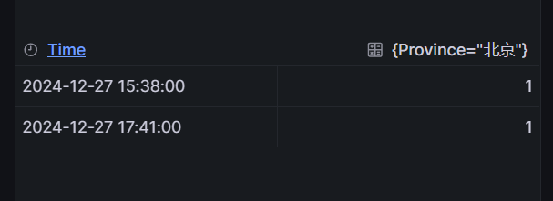
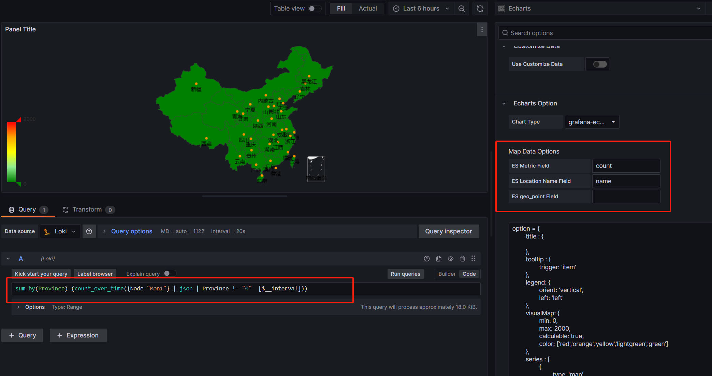

## Echarts Panel Plugin for Grafana（loki版本）

Grafana集成Echarts
1. grafana:9.5.21
2. loki:2.9.2
3. promtail:2.9.2
4. Echarts v4.0.x

基于 https://github.com/xinggengchang/grafana-china-map-plugin 版本修改
支持loki查询，去掉了es查询

ES Metric Field填value

ES Location Name Field填name

loki查询语句

```
sum by(Province) (count_over_time({Node="Mon1"} | json | Province != "0"  [$__interval]))
```
查询结果如图



controller.js 会自动提取name=北京,value=1，写入ctrl.data

**Metrics/option**



```javascript
option = {
	title : {
	
	},
	tooltip : {
		trigger: 'item'
	},
	legend: {
		orient: 'vertical',
		left: 'left'
	},
	visualMap: {
		min: 0,
		max: 2000,         
		calculable: true,
		color: ['red','orange','yellow','lightgreen','green']
	},
	series : [
		{
			type: 'map',
			mapType: 'china',
			hoverable: true,
			roam:true,
			itemStyle:{
				normal:{label:{show:true}, areaColor: '#edf2f1'},
				emphasis:{label:{show:true}, areaColor: '#06060f'}
			},
			mapLocation: {
				y: "center",
				x: "center",
				height: "320"
			},
			label: {
				normal: {
					show: true
				},
				emphasis: {
					show: true
				}
			},
			data: ctrl.data
		}
	]
};
```

## 插件安装
将本实例clone到你的plugins目录后，添加grafana.ini，重启grafana服务

```ini
vi grafana.ini

[plugins]
allow_loading_unsigned_plugins = grafana-echarts-panel

[plugin.grafana-echarts-panel]
# 根据实际路径填写
path = /var/lib/grafana/plugins/grafana-china-map-plugin-main

```

注：如需修改不要编译，直接修改dist的文件即可